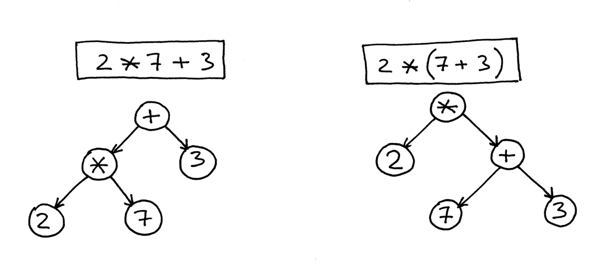

# Dot-K Programming Language

## Description

`Dot-K` is a basic dynamically typed interpreted language written in C.

_To read more about the implementation, please see the `Implementation` section._

## Math

`Dot-K` Can handle very basic math, including addition, subtraction, multiplication, division, integer division and modulo.
It naturally follows the order of operations unless specified otherwise with parentheses.

```py
+  # Addition
-  # Subtraction
*  # Multiplication
/  # Division
// # Integer Division
%  # Modulo Operator 
```

`Dot-K` also has the built-in function `abs` that returns the absolute value of type `INT` and `FLOAT`.  

More math examples can be seen in `examples/math.k`

## Printing

Using the builtin function `print`, you can print to the standard output.

The following code is an example of how to use the `print` function:

```py
print("This is printing a string");
print(41, 3.123, 1==1);
```

You can also format strings with the `+` operator. For example:

```py
print("It is " + 1==1 + " that 1 is equal to 1");
# Output: "It is True that 1 is equal to 1"

print("It is " + 2==1 + " that 2 is equal to 1");
# Output: "It is False that 2 is equal to 1"
```

More print examples can be seen in `examples/print.k`

## Variable Declarations

Float, Int, String, Array and Boolean variables can be declared by using the key word `var`.

The following code is an example of how to declare an int var `x`:

```js
var x = 41;
```

More variable declaration examples can be seen in `examples/variables.k`

## Type Casting
Values in `Dot-K` can be type casted to `Boolean`, `Float`, `Int`, `Str` and `Array`. 
The following code contains examples of valid type casts:
```py
print(int(0));        # Output: 0
print(int(1));        # Output: 1
print(int("1"));      # Output: 1
print(int(1.1));      # Output: 1
print(float());       # Output: 0.00
print(float(1.1));    # Output: 1.10
print(float("1.1"));  # Output: 1.10
print(float(1));      # Output: 1.00
print(str());         # Output: ""
print(str(1.1));      # Output: "1.10"
print(str(1));        # Output: "1"
print(str({1,2,3}));  # Output: "[1, 2, 3]"
print(bool());        # Output: False
print(bool(0));       # Output: False
print(bool(0.0));     # Output: False
print(bool(1));       # Output: True
print(bool(1.1));     # Output: True
print(bool({}));      # Output: False
print(bool({1,2,3})); # Output: True
print(bool(""));      # Output: False
print(bool("True"));  # Output: True
print(bool("False")); # Output: False
print(list());        # Output: []
print(list({1,2,3})); # Output: [1, 2, 3]
print(list("Hi"));    # Output: ["H", "i"]
print(list(range(2)));# Output: [0, 1]
``` 
## Loops
### For each loops
Using the key word `for`, a for each loop can be declared.
The following code contains how a for each loop should be structured:
```js
for(<VAR_NAME> : <ITTERABLE>){
    <CODE_TO_BE_EXECUTED>;
}
```
### While loops
Using the key word `while`, while loops can be declared.
The following code contains how while loop should be structured:
```js
while(<PREDICATE>){
    <CODE_TO_BE_EXECUTED>;
}
```  
### Break statements
With the key word `break`, one can preemptively exit a loop. The following code snippets are examples of that:
```py
while(True){
    print("This is inside the while loop");
    if(1 == 1){
        break;
    }
    print("Should not print");
}
# Output: "This is inside the while loop"
```
```py
for(x : range(10)){
    if(x > 4){
        print(x);
        break;
    }
}
# Output: 5 
```
### Return statements
In `Dot-K` one can use the `return` in conjunction with `while` and `for each` loops to assign variables. For example:
```js
var x = 3;
var k = while(x > 0){
            if(x == 1){
                return x;
            }
            x = x - 1;
        };
```
```js
var x = 3;
var k = for (i : range(10)){
            if ((i % x) == 1){
                return i;
            }
        };
```
```py
print("Val of k is " + k);
# Output: "Val of k is 1"  
```

More loop examples can be seen in `examples/loops.k`
## Arrays

Arrays containing Floats, Ints, Strings and/or Arrays can be explicitly declared or declared with a set size and default value. 

### Ranged Objects
Much like `python`, `Dot-K` has a `range` built-in function. There are three ways this function can be used. 
```py
# range(end)
list(range(3));
# Output: [0, 1, 2]

# range(start, end)
list(range(4,8));
# Output: [4, 5, 6, 7]

# range(start, end, step)
list(range(-6,-10,-3));
# Output: [6, 9]
```

### Fixed size array
The following code containts examples of how to declare fixed size arrays in `Dot-K`:
```py
# [size_of_array]{default value}
[4];         # Output: [NULL, NULL, NULL, NULL]
[4]{0};      # Output: [0, 0, 0, 0]
[2][2];      # Output: [[NULL, NULL], [NULL, NULL]] 
[2][2]{0};   # Output: [[0, 0], [0, 0]] 
[2]{[2]{0}}; # Output: [[0, 0], [0, 0]] 
```

### Explicitly declared arrays
The following code containts examples of how to explicit arrays in `Dot-K`:
```py
# {Elements Separated by a Comma}
{1, 2, 3.14, "4"}      # Output: [1, 2, 3.14, "4"]
{[2]{"1"}, 2, 3, True} # Output: [["1", "1"], 2, 3, True]
{{1, 2}, {3}, 4, 5}    # Output: [[1, 2], [3], 4, 5]
```

### Indexing
Arrays in `Dot-K` can be indexed much like in Python *_without slices_*.
For example, indexing can be done with negative numbers (`-1 referring to the last element of the array`). 

More array examples can be seen in `examples/arrays.k`

## Function Definitions

Using the key word `def`, various functions can be defined with the `Dot-K` language.

### Functions without Arguments

The following code is an example of how to define and call a function `foo`:

```python
def foo(){
    print("This is function 'foo'");
}

foo();
# Output: This is function 'foo'
```

### Functions with Arguments

The following code is an example of how to define and call a function `foo`:

```python
def foo(x){
    print("This is function 'foo' " + x);
}

foo("with arguments!");
# Output: This is function 'foo' with arguments!
```

### Functions with Return Statements

The following code is an example of how to define and call functions `foo` and `bar` that take advantage of the `return` key word to return data:

```python
def foo(x){
    return x + 1;
}

def bar(x){
    if(x == 0){
        return 1;
    }else{
        return 2.13 * x;
    }
}

print(foo(2)); # Output: 3
print(bar(0)); # Output: 1
print(bar(2)); # Output: 4.26
```

### Functions and Recurssion

The following code is an example of how `Dot-K` can handle simple recursion.

```py 
def fact(x){
    if(x < 2){
        return 1;
    }else{
        return x * fact(x-1);
    }
}
print("5! == " + fact(5));
# Output: 5! == 120
```

_If you would like to see more, take a look at `examples/factorial.k` as well as `examples/fibonacci.k`_

More function definition examples can be seen in `examples/functions.k`

## if-else Statements

Much like many other programming languages `Dot-K` has support for `if-else` statements.

The following code is an example of how to use them:

```py
# Output: 'a' is less than 'z'
if("a" < "z"){
    print("'a' is less than 'z'");
}else{
    print("Something is wrong!");
}

# Output: 'a' > 'z' OR 1 == 1
if("a" > "z" || 1 == 1){
    print("'a' > 'z' OR 1 == 1");
}else{
    print("Something is wrong!");
}


# Output: 'a'<'z' OR 1 == 1
if("a" > "z" && 1 != 1){
    print("'a' > 'z' AND 1 != 1");
}else{
    print("'a'<'z' OR 1 == 1");
}
```

## Future Features

### Improving Memory Management by Cleaning up Architecture
Currently, there is little to no memory management found in the code; this leads to a lot of memory leaks and sub-optimal code. By refactoring the architecture and cleaning up technical debt performance of `Dot-K` will hopefully improve.

### Creating a shell
A `Dot-K` shell would allow for on-the-fly execution of `Dot-K` code - much like `python`.


## Implementation

### Lexing

Looking at the input file as one entire string, individual tokens are returned depending on the current `char` that the lexer sees. For example, if a `~` is encountered, all chars are ignored until another `~` is read -- this allows for a block comment. This logic extends to lexing `ints`, `floats` and `operators`.

For example, the following code

```js
var x = 12;
```

would be lexed to the following list of tokens

```js
[
  Token("var", ID_TOKEN),
  Token("x", ID_TOKEN),
  Token("=", EQ_TOKEN),
  Token("12", INT_TOKEN),
  Token(";", SEMI_TOKEN),
]
```

### Parsing

Proceeding the lexing process tokens are looked at one at a time and parsed into Abstract Syntax Trees (ASTs). This structures the data into trees that when transverse, execute the code as intended.

For example, the two following expressions would be expressed as such:


### Visiting

Now that we have our ASTs lined up, all that's left is to transverse them properly. This is done by controlling whether we use an inorder, preorder or postorder approach to visit the AST subtree of a given node.

## Syntax Highlighting

If you're using `Visual Studio Code`, you can add the `dotk-syntax-highlighting` directory to your vscode extensions directory and reloading Visual Studio Code.

For MacOS and Linux you can run the following from the root directory:

```bash
cp -r ./dotk-syntax-highlighting ~/.vscode/extensions/dotk-syntax-highlighting
```

For Windows systems you can run the following from the root directory:

```dos
cp .\dotk-syntax-highlighting %USERPROFILE%\.vscode\extensions
```

## Installing & Running

From the root directory, run the following:

```bash
sudo make install
dotk example/factorial.k
```

_NOTE: This was meant to be run on a debian based system. Edit the `Makefile` to fit your system._
